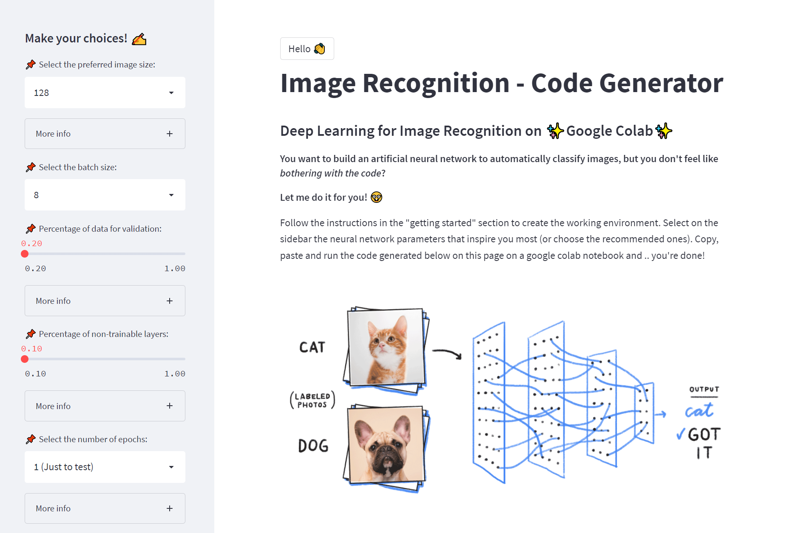
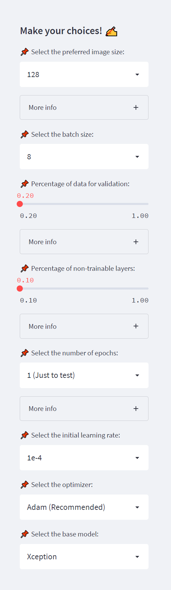

# 👩‍💻 Deep Learning for Image Recognition on Google Colab - Code Generator
## 👉 **Check it out [here](https://share.streamlit.io/paulinomoskwa/dl-code-generator/main.py)!**

    

## 📖 **About**
This project comes with the goal of facilitating the writing of the code needed to **create an artificial neural network for classification**. No in-depth knowledge of neural networks or programming is required to take advantage of this website to train a customized neural network. The website relies on two core libraries:

* `streamlit` for putting a webapp into production
* `tensorflow` for managing the neural network

By following the instructions in the *Getting Started* section, the appropriate workspace can be created. Then it is sufficient to set the preferences regarding the neural network on the left sidebar (or select the recommended ones) and the code will be automatically customized. 

    

